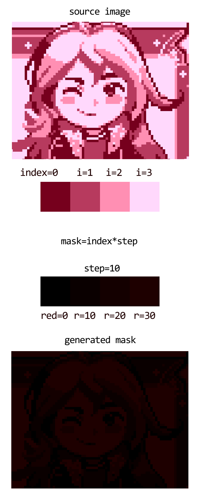

# redmask
Tool to create palette mask


## How a palette mask works

A palette mask is an image used to map a palette using a gradient scale.

The tool will generate a red gradient image because green and blue values are useless for the mask.

Full explanation about palette mask: [https://www.youtube.com/watch?v=u4Iz5AJa31Q](https://www.youtube.com/watch?v=u4Iz5AJa31Q)



## Using the generated mask

The mask can be used in a palette swap shader.

Example shader in Godot Engine 2.1.x:

```glsl
// fragment
uniform texture palette;
uniform float colors;
uniform float color_step;

if (COLOR.a != 0){
    COLOR = tex(palette, vec2((COLOR.r*255.0)/(colors-0.001) / color_step, 0));
}
// '0.001' part is a workaround to fix float precision issues.
```

## Basic usage

```bash
# redmask = python redmask.py

redmask <input> <palette>
# generate a mask using default color step (1)

redmask <input> <palette> -s 10
# generate a mask using 10 as color step

redmask <generated-mask> <palette> -a
# apply a palette (paint the mask) using default color step (1)
```

You can test using images in the `tests` directory.

Also, you can view usage info using the `-h/--help` command.
